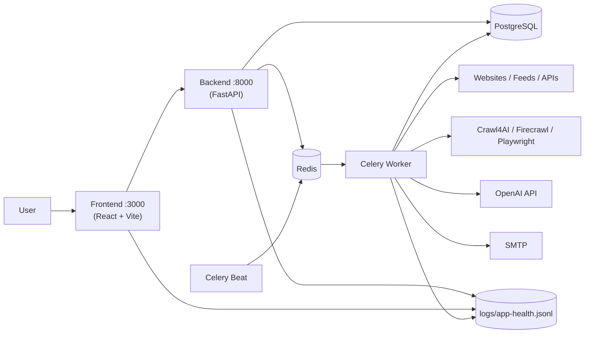
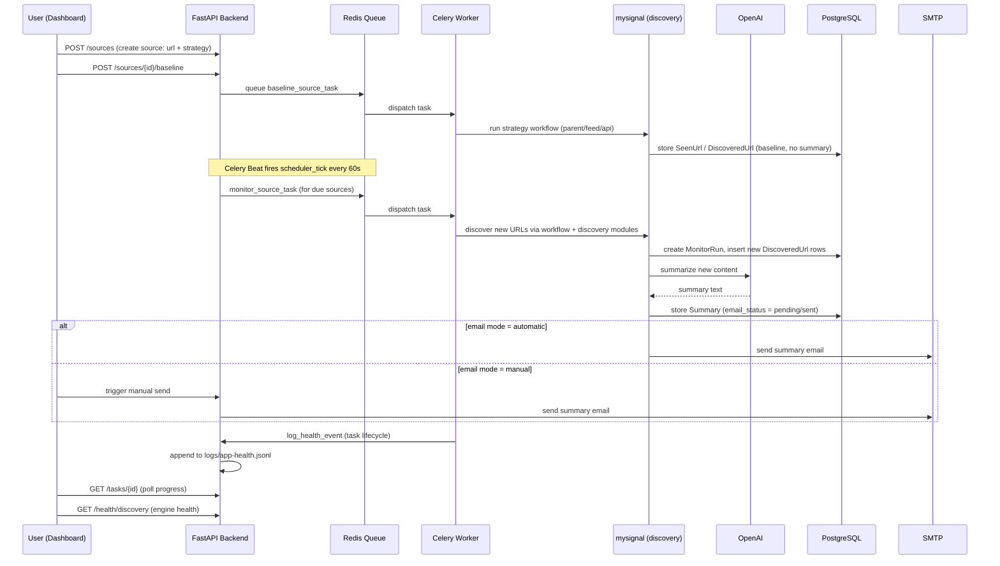

# DesignX — Website Monitor Architecture

> A local operations console that watches company websites, RSS/Atom feeds, and APIs for new content, summarizes what changed using OpenAI, and emails the results.

---

## 1. What The App Does

Website Monitor answers one question: **"What changed on the sites I care about?"**

1. You create a **Company**.
2. You add one or more **Sources** (URLs) to that company, each with a discovery strategy:
   - `parent` — a normal web page; new links are discovered from a parent page (optionally tracing JS bundles for SPA/API-driven sites).
   - `feed` — an RSS/Atom feed.
   - `api` — a JSON API-style source.
3. The system **baselines** the source (records existing URLs without summarizing them).
4. A scheduler checks enabled sources on a recurring interval.
5. Newly discovered URLs are scraped and **summarized with OpenAI**.
6. Summaries are emailed to configured recipients, either manually or automatically.

---

## 2. Tech Stack

| Layer | Technology | Role |
|---|---|---|
| Frontend | React 19, TypeScript, Vite 6 | Browser dashboard (custom router, not Next.js despite `app/` naming) |
| Styling / UI | Tailwind CSS 3, Radix UI primitives, lucide-react, Sonner | Interface, controls, icons, toasts |
| Data fetching | TanStack React Query 5, Axios | API calls, caching, mutations, polling |
| Backend API | Python, FastAPI (≥0.115), Uvicorn | REST API consumed by the dashboard |
| Database | PostgreSQL 16, SQLAlchemy 2.x (Mapped/mapped_column), Alembic | System of record + migrations |
| Background jobs | Celery ≥5.4, Redis ≥5.0, Celery Beat | Async task execution and scheduling, off the request path |
| Crawling & parsing | Crawl4AI 0.9.0, Firecrawl, BeautifulSoup4, feedparser, lxml, Playwright (optional) | URL discovery and content extraction across pages, feeds, and APIs |
| AI summarization | OpenAI SDK ≥2.0 | Turns discovered content into readable summaries; optionally assists endpoint discovery |
| Email | SMTP (smtplib via `mysignal/notifications`) | Sends summary notifications to recipients |
| Observability | Custom JSONL health logger (`logs/app-health.jsonl`) | Structured event log across frontend, backend, worker, scheduler, email |
| Runtime | Docker Compose | Orchestrates all 6 services together |
| Config | python-dotenv, `.env` | Centralized environment-based configuration |

---

## 3. Runtime Services (Docker Compose)

Six services, defined in [docker-compose.yml](docker-compose.yml):

| Service | Image / Build | Purpose | Resource caps |
|---|---|---|---|
| `frontend` | `frontend/` (Vite dev server) | Dashboard at `http://localhost:3000` | 768m / 1 CPU |
| `backend` | `backend/Dockerfile` | FastAPI at `http://localhost:8000`; runs `alembic upgrade head` on boot | 1g / 1 CPU |
| `postgres` | `postgres:16` | Primary data store | — |
| `redis` | `redis:7` | Celery broker/result backend | — |
| `celery-worker` | `backend/Dockerfile` | Executes crawl/baseline/summarize/monitor tasks (concurrency 2, `-Ofair`, prefetch 1) | 3g / 2 CPU |
| `celery-beat` | `backend/Dockerfile` | Fires `scheduler_tick` every 60s | 512m / 0.5 CPU |

All backend-family containers share `./logs` and `./mysignal/data` as bind-mounted volumes, so the health log and the JSON discovery-cache/dedup files persist across restarts and are visible to every worker.



The frontend never crawls websites directly — it only calls the backend API. The backend queues long-running work through Celery so HTTP requests stay fast.

---

## 4. Directory Structure

```
website_monitor/
├── backend/                     FastAPI app, DB models, routers, workers, services
│   └── app/
│       ├── main.py              App factory, CORS, request-timing middleware, router registration
│       ├── config.py            Settings dataclass (DATABASE_URL, REDIS_URL) via dotenv
│       ├── database.py          SQLAlchemy engine/session (Base, SessionLocal, get_db)
│       ├── models.py            ORM models: Company, Source, MonitorRun, DiscoveredUrl, Summary, ...
│       ├── schemas.py           Pydantic request/response schemas
│       ├── crud.py              DB query helpers used by routers
│       ├── observability.py     JSONL health-event logger
│       ├── routers/             companies, sources, email, monitor, runs, storage, tasks, health
│       ├── services/
│       │   └── monitor_service.py   Core orchestration: baseline & monitor run logic
│       └── workers/
│           ├── celery_app.py    Celery app + signal-based health logging
│           ├── monitor_worker.py   Celery tasks (ping, baseline, monitor, run-all)
│           └── scheduler.py     scheduler_tick — polls due sources every minute
├── mysignal/                    Crawling / discovery / summarization engine ("the signal pipeline")
│   ├── collector/, crawler/     firecrawl_collector.py, crawl4ai_collector.py
│   ├── discovery/               advanced_discovery.py, api_discovery.py, page_links.py, filters.py, categorizer.py, site_graph.py
│   ├── filters/                 content_filter.py — filters non-article URLs
│   ├── processors/              article_processor.py — content → summary pipeline
│   ├── summarizers/             openai_summarizer.py
│   ├── notifications/           smtp_email.py
│   ├── monitoring/              inventory_monitor.py, inventory_store.py (JSON seen-URL store)
│   ├── workflows/               parent_monitor.py, feed_monitor.py, api_monitor.py, new_url_processor.py, discovery.py
│   ├── models/                  article.py
│   └── data/                    seen_url_records.json, discovery_adapters.json (runtime state)
├── frontend/                    React 19 + Vite dashboard
│   ├── app/                     page.tsx, companies/, sources/, sources/[id]/, runs/, email/, settings/, storage/
│   ├── components/              app-shell.tsx, router.tsx, source-form-dialog.tsx, status-badge.tsx, task-progress-dialog.tsx, ui/
│   └── lib/                     api.ts (Axios client), query-keys.ts, health-events.ts
├── alembic/versions/            Database migrations
├── scripts/                     Standalone/manual tooling (baseline_parent_monitor.py, recursive_monitor.py, explore_setup.py)
├── tests/                       test_advanced_discovery.py, test_api_discovery.py
├── docs/HEALTH_LOGGING.md       Health log format reference
├── logs/                        app-health.jsonl (runtime log, volume-mounted)
├── docker-compose.yml, alembic.ini, .env.example
```

---

## 5. Data Model

| Entity | Purpose | Key fields |
|---|---|---|
| `Company` | Top-level grouping | `name`, 1:N `Source`, 1:N `NotificationRecipient` |
| `Source` | A URL to watch | `url`, `strategy` (`parent`/`feed`/`api`), `trace_js`, `js_bundle_sources`, `enabled`, `schedule_minutes`, `last_checked_at` |
| `SeenUrl` | Dedup record per source+url | unique constraint on (source, url) |
| `MonitorRun` | One check execution | `status` (running/completed/failed), `started_at`, `finished_at`, `error` |
| `DiscoveredUrl` | A URL found during a run | `payload` (JSON trace metadata) |
| `Summary` | OpenAI summary of a discovered URL | `email_status`, `email_sent_at`, `email_error` |
| `NotificationRecipient` | Per-company email recipient list | — |
| `AppSetting` | Global key/value settings | e.g. email mode: manual vs. automatic |

A parallel **JSON file store** (`mysignal/data/seen_url_records.json`, `discovery_adapters.json`) is used alongside Postgres for URL de-duplication and cached per-site "discovery adapters" — a legacy/complementary mechanism from earlier iterations of the crawler, still consulted by the discovery workflows.

---

## 6. Backend Architecture

### Entry points
- [backend/app/main.py](backend/app/main.py) — FastAPI app, CORS, HTTP timing middleware (logs every request to the health log), router registration.
- [backend/app/workers/celery_app.py](backend/app/workers/celery_app.py) — Celery app; registers `monitor_worker` and `scheduler` task modules; wires signals (`worker_ready`, `task_prerun`, `task_postrun`, `task_failure`, `beat_init`) to `observability.log_health_event`.

### API surface (all mounted in `main.py`)
| Router | Prefix | Responsibility |
|---|---|---|
| `health` | `/health` | `GET /health`, `GET /health/discovery` (discovery-engine health summary), `POST /health/events` (frontend telemetry ingestion) |
| `companies` | — | CRUD for companies |
| `sources` | `/sources` | CRUD + `/runs`, `/discovered-urls`, `/summaries`, `/discovery-preview`; triggers baseline/monitor Celery tasks |
| `email` | — | Recipients, SMTP status, email-mode settings, manual send |
| `monitor` | `/monitor` | `POST /monitor/run-all` (queues all enabled sources), `GET /monitor/status` |
| `runs` | — | List monitor runs |
| `storage` | — | List stored/seen URLs |
| `tasks` | `/tasks` | `GET /tasks/{task_id}` — polls Celery `AsyncResult` for task progress (used by the frontend's task-progress dialog) |

### Background jobs
- **Celery Beat** fires `monitor.scheduler_tick` every 60 seconds.
- [scheduler.py](backend/app/workers/scheduler.py) queries all `Source` rows, skips disabled/not-due/already-running ones (`last_checked_at + schedule_minutes`), and dispatches `monitor_source_task.delay(source.id)` for due sources.
- [monitor_worker.py](backend/app/workers/monitor_worker.py) defines: `ping_worker`, `baseline_source_task`, `monitor_source_task`, `run_all_enabled_sources_task` — all delegating to `monitor_service.py`.

### Configuration
`.env` (see `.env.example`) drives `DATABASE_URL`, `REDIS_URL`, `OPENAI_API_KEY`, `FIRECRAWL_API_KEY`, SMTP settings, and a family of `DISCOVERY_*` tuning knobs (browser tracing, LLM-assisted planning, endpoint/URL caps, heavy-discovery lock TTL). `backend/app/config.py` loads DB/Redis URLs into a frozen `Settings` dataclass; discovery knobs are read directly from env inside `mysignal/discovery/advanced_discovery.py`.

---

## 7. The `mysignal` Discovery & Summarization Engine

This is the crawling core, independent of the FastAPI/Celery scaffolding:

- **`page_links.py`** — HTML link extraction/normalization for `parent`-strategy sources.
- **`api_discovery.py`** — candidate JSON endpoint discovery/validation, plus JS-bundle source discovery for `trace_js`-enabled sources (SPA sites where content loads via API calls, not static HTML).
- **`advanced_discovery.py`** (938 lines, newest/largest module — the "Mark IV" addition) — heavier discovery combining:
  - Playwright-based browser tracing of network responses (optional, `DISCOVERY_ENABLE_BROWSER`)
  - An OpenAI-assisted endpoint "planner" (optional, `DISCOVERY_ENABLE_LLM`) that helps decide which discovered endpoints are worth following
  - Adapter caching (`mysignal/data/discovery_adapters.json`) to skip redundant heavy discovery
  - A file-based lock with TTL (`DISCOVERY_HEAVY_LOCK_TTL_SECONDS`) to prevent concurrent heavy discovery runs on the same source
  - `discovery_health_summary()` — reports OpenAI config status, browser/Playwright availability, adapter cache state, and recent discovery event/error counts (backs `GET /health/discovery`)
- **`content_filter.py`** — filters out non-article/noise URLs before they're treated as "discovered content".
- **`workflows/`** — one module per strategy (`parent_monitor.py`, `feed_monitor.py`, `api_monitor.py`), plus `new_url_processor.py` which turns a newly discovered URL into a stored `Summary`.
- **`processors/article_processor.py`** → **`summarizers/openai_summarizer.py`** — scrapes and summarizes content via the OpenAI API.
- **`notifications/smtp_email.py`** — sends summary emails to `NotificationRecipient`s (or JSON-configured fallback recipients).

---

## 8. End-to-End Data Flow



1. User creates a `Company` and `Source` via the React dashboard.
2. A **baseline** run records existing URLs without summarizing (`baseline_source_task`).
3. **Celery Beat** ticks every 60s; `scheduler_tick` queues `monitor_source_task` for any due, enabled source.
4. The strategy-specific workflow (`parent_monitor` / `feed_monitor` / `api_monitor`) discovers candidate URLs, filtered through `content_filter.py` and de-duplicated against both the DB (`SeenUrl`) and the JSON store (`inventory_store.py`).
5. New URLs become `DiscoveredUrl` rows attached to a `MonitorRun`.
6. `new_url_processor.process_new_url_record` → `article_processor.summarize_url` → `openai_summarizer.py` produces a summary, persisted as a `Summary` row.
7. Depending on the `AppSetting` email mode, the summary is emailed automatically via `smtp_email.py`, or queued for manual send from the dashboard's email view.
8. Every step — HTTP requests, Celery task lifecycle, discovery events, email events, frontend actions — is appended to `logs/app-health.jsonl` via `observability.log_health_event`, and surfaced back to the dashboard through `GET /health/discovery` and `POST /health/events`.

---

## 9. Frontend Architecture

- **Routing**: custom router ([components/router.tsx](frontend/components/router.tsx)) over Vite — not Next.js, despite the `app/` directory naming convention.
- **Pages** ([frontend/app/](frontend/app/)): dashboard home (`page.tsx`), `companies/`, `sources/` + `sources/[id]/` detail, `runs/`, `email/`, `settings/`, `storage/`.
- **Data layer**: `lib/api.ts` (Axios client) + TanStack React Query (`lib/query-keys.ts`) for fetching, caching, and mutating backend data. No WebSockets — long-running actions (baseline/monitor runs) are tracked via `task-progress-dialog.tsx` polling `GET /tasks/{task_id}`.
- **UI kit**: Radix UI primitives (dialog, select, slot, switch) wrapped with Tailwind CSS, `class-variance-authority`/`tailwind-merge` for style composition, `lucide-react` icons, `sonner` for toast notifications.
- **Observability hook**: `lib/health-events.ts` posts frontend-originated events to `POST /health/events`, feeding the same JSONL health log the backend writes to.

---

## 10. Observability

A single structured log — `logs/app-health.jsonl` — is the shared debugging surface across every component:

- Backend: every HTTP request (via middleware in `main.py`)
- Celery: task lifecycle signals (`task_prerun`, `task_postrun`, `task_failure`, `beat_init`, `worker_ready`)
- Discovery engine: heavy-discovery attempts, cache hits, LLM planner calls, errors
- Email: send attempts, successes, failures
- Frontend: key user actions, posted via `POST /health/events`

`GET /health/discovery` aggregates recent log entries plus live config checks (OpenAI key present, Playwright available, adapter cache state) into a single health summary consumed by the dashboard's status badges. See [docs/HEALTH_LOGGING.md](docs/HEALTH_LOGGING.md) for the full event schema.

---

## 11. Evolution (Git History)

The project has grown through solo-dev iterations, visible in the commit log:

| Stage | Commit | What changed |
|---|---|---|
| Mark 1 | `5ec1f6d` | Basic single-URL tracker |
| Mark II | `9469c25` | Generalized to track any specific URL |
| — | `d6abfce` | Added RSS/Atom feed support and multiple email recipients |
| — | `7f61edf` | Removed unnecessary extra filtering |
| — | `b670176` | Upgraded endpoint/API-strategy support |
| — | `508637c` | Pre-production hardening |
| Mark 3 | `f0db52a` | Full-stack rewrite: FastAPI + React + PostgreSQL + Celery |
| — | `fcda4f8` | Data/seed commit |
| — | `05c48c2` | JS-bundle tracing (`trace_js`, `js_bundle_sources`) for SPA/API-heavy sites |
| Mark IV | `de845ee` | Introduced `advanced_discovery.py` — Playwright browser tracing + LLM-assisted endpoint planning |
| Mark IV: Agent Monitoring | `3a2f807` (current) | Added `/health/discovery` and `discovery_health_summary()` — observability into the discovery engine's own health, not a multi-agent LLM system |

**Note**: "Agent Monitoring" in the latest commit refers to monitoring the health of the automated discovery *pipeline* (config validity, cache state, error rates), not a multi-agent LLM framework — there is no agent orchestration layer in this codebase today.

---

## 12. Key Files Reference

| File | Why it matters |
|---|---|
| [backend/app/services/monitor_service.py](backend/app/services/monitor_service.py) | Core orchestration between routers, Celery tasks, and `mysignal` workflows |
| [backend/app/models.py](backend/app/models.py) | Full relational schema |
| [backend/app/workers/celery_app.py](backend/app/workers/celery_app.py) / [scheduler.py](backend/app/workers/scheduler.py) | Scheduling and task dispatch |
| [mysignal/discovery/advanced_discovery.py](mysignal/discovery/advanced_discovery.py) | Most complex module; browser + LLM-assisted discovery, health summary |
| [mysignal/workflows/](mysignal/workflows/) | Per-strategy monitoring logic (`parent`, `feed`, `api`) |
| [mysignal/summarizers/openai_summarizer.py](mysignal/summarizers/openai_summarizer.py) | AI summarization step |
| [mysignal/notifications/smtp_email.py](mysignal/notifications/smtp_email.py) | Email delivery |
| [frontend/lib/api.ts](frontend/lib/api.ts) | Frontend↔backend contract |
| [docker-compose.yml](docker-compose.yml) | Full service topology and env wiring |
| [docs/HEALTH_LOGGING.md](docs/HEALTH_LOGGING.md) | Health log schema |
