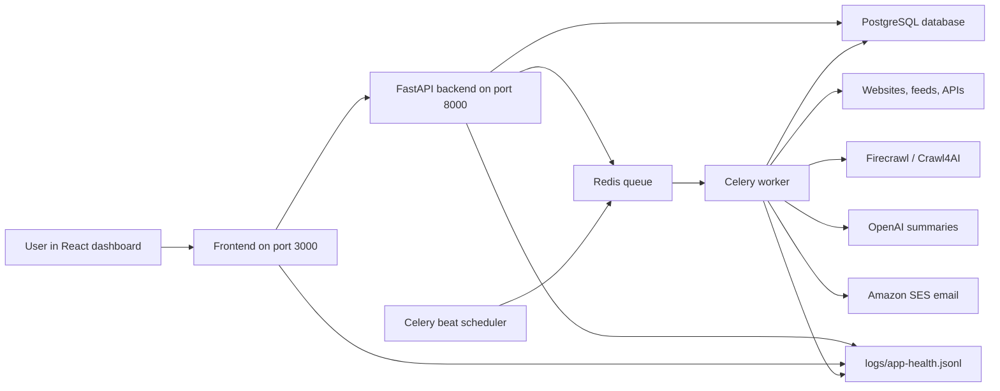

# Website Monitor

Website Monitor is a local dashboard and background monitoring system for tracking company websites, feeds, and APIs. You add companies and sources, the system checks those sources on a schedule, stores newly discovered URLs, summarizes useful content with OpenAI, and can send summary emails to configured recipients.

The project is built to feel like an operations console: the frontend is where you manage sources and inspect activity, while the backend and workers do the crawling, processing, storage, scheduling, and notifications.

## What It Does

At a high level, the app answers one question: "What changed on the sites I care about?"

1. You create a company.
2. You add one or more sources for that company.
3. Each source uses a strategy:
   - `parent` for normal web pages where links are discovered from a parent page.
   - `feed` for RSS/Atom feeds.
   - `api` for API-style sources.
4. The system creates a baseline so it knows what URLs already exist.
5. Scheduled workers check enabled sources over time.
6. New URLs are stored as discovered URLs and attached to monitor runs.
7. New content can be scraped, summarized with OpenAI, and made available for review.
8. Email notifications can be sent manually or automatically depending on the email mode.

## How The Pieces Fit Together



The frontend never crawls websites directly. It calls the backend API, and the backend queues longer jobs through Celery so the UI stays responsive.

## Tech Stack

| Area | Technology | Role |
| --- | --- | --- |
| Frontend | React, Vite, TypeScript | Builds the browser dashboard. |
| Styling | Tailwind CSS, Radix UI, Lucide icons, Sonner | Provides the interface, controls, icons, and notifications. |
| Data fetching | TanStack React Query, Axios | Loads API data, caches responses, and handles mutations from the UI. |
| Backend API | Python, FastAPI, Uvicorn | Exposes the REST API used by the dashboard and workers. |
| Database | PostgreSQL, SQLAlchemy, Alembic | Stores companies, sources, runs, discovered URLs, summaries, recipients, and settings. |
| Background jobs | Celery, Redis, Celery beat | Runs monitor jobs and scheduled checks outside the request/response path. |
| Crawling and parsing | Firecrawl, Crawl4AI, BeautifulSoup, Feedparser, lxml | Discovers URLs and extracts content from web pages, feeds, and API-like sources. |
| AI summaries | OpenAI API | Turns processed content into readable summaries. |
| Email | Amazon SES | Sends summaries to configured recipients. |
| Runtime | Docker Compose | Runs the frontend, backend, database, queue, worker, and scheduler together. |
| Observability | JSONL health logs | Records backend requests, frontend API calls, scheduler ticks, worker tasks, and email events. |

## Main Folders

```text
backend/       FastAPI app, database models, routers, workers, and services
frontend/      React/Vite dashboard
mysignal/      Crawling, discovery, filtering, processing, and summarization workflows
alembic/       Database migrations
logs/          Runtime health and activity logs
docs/          Supporting documentation
scripts/       Utility scripts used during exploration or monitoring
```

## Runtime Services

Docker Compose starts six services:

| Service | Purpose |
| --- | --- |
| `frontend` | Serves the React dashboard at `http://localhost:3000`. |
| `backend` | Serves the FastAPI API at `http://localhost:8000`. |
| `postgres` | Stores the main application data. |
| `redis` | Holds Celery task messages. |
| `celery-worker` | Executes crawling, baselining, summarization, and monitor jobs. |
| `celery-beat` | Triggers the scheduler every minute. |

## Running The Project

Create your local environment file from the example:

```powershell
Copy-Item .env.example .env
```

Fill in the values you need, especially:

```text
OPENAI_API_KEY
FIRECRAWL_API_KEY
fire_crawler_api
EMAIL_ADDRESS
SES_FROM_EMAIL
SES_DEFAULT_RECIPIENTS (legacy command-line monitor only)
SES_CONFIGURATION_SET (optional)
```

Then start the whole stack:

```powershell
docker compose up -d
```

Open the dashboard:

```text
http://localhost:3000
```

Check the backend directly:

```text
http://localhost:8000/health
```

To stop the stack:

```powershell
docker compose down
```

## Typical Workflow

1. Open the dashboard.
2. Create a company.
3. Add a source URL and choose the right strategy.
4. Run a baseline to store existing URLs without summarizing them.
5. Let the scheduler check enabled sources, or manually run a source.
6. Review monitor runs and discovered URLs.
7. Review generated summaries.
8. Send summary emails manually, or switch email mode to automatic.

## Health And Debugging

The main health log is:

```text
logs/app-health.jsonl
```

It records structured events from the frontend, backend, worker, scheduler, and email flow. If something feels wrong, this file usually tells you whether the issue is a failed API request, a failed worker task, a crawler problem, or an email delivery problem.

Useful checks:

```powershell
docker compose ps
docker compose logs --tail 100 backend frontend celery-worker celery-beat
```

For frontend validation:

```powershell
cd frontend
npm run lint
npm run build
```

## Data Model In Plain English

- A `Company` owns monitor sources and email recipients.
- A `Source` is a URL to watch, with a strategy and schedule.
- A `MonitorRun` records one check of one source.
- A `DiscoveredUrl` is a URL found during a baseline or monitor run.
- A `Summary` stores the OpenAI-generated summary for discovered content.
- A `NotificationRecipient` stores who should receive email summaries for a company.
- An `AppSetting` stores small global settings such as email notification mode.

## Current Shape Of The App

The project is meant to be run locally through Docker Compose. The dashboard is the control surface, FastAPI is the API layer, PostgreSQL is the source of truth, Redis and Celery handle background work, and the `mysignal` package contains the crawling and processing logic that makes the monitor useful.

In short: the frontend lets you operate the system, the backend coordinates it, the worker does the heavy lifting, and the logs show what happened.
